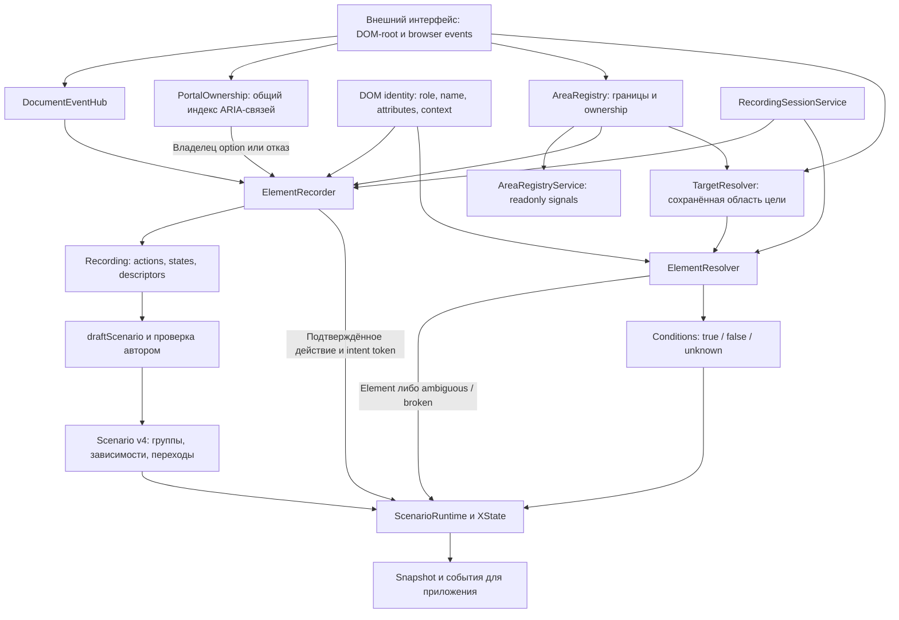

# Библиотека Training Observer

Библиотека записывает действия пользователя в существующем интерфейсе, сохраняет описание DOM-целей и проверяет
прохождение учебного сценария. Она наблюдает DOM/browser events и свойства controls, не получая внутреннюю модель
целевого Angular-приложения. При недостаточных признаках поиск возвращает отказ, а не выбирает цель по позиции.

Документ описывает **библиотеку**. Demo — внешнее тестовое приложение; его устройство и запуск описаны в
[README](README.md). Формы demo не являются частью архитектуры наблюдателя.

## Библиотека и приложения

Библиотека работает **без UI**: наблюдает DOM, описывает и находит цели, проверяет действия и условия, отдаёт состояние
и события через программный API. Angular-интеграция отвечает за DI и lifecycle, без визуальных компонентов.

**Админка** — отдельное приложение для записи и редактирования заданий, подсказок, значений, веток и completion. **Режим
ученика** — существующий рабочий интерфейс с автоматической проверкой. При входе в тренировку интеграция загружает
сценарий и запускает наблюдение без кнопки «Начать обучение» и отдельной панели. Подсказки отображает приложение по
событиям/состоянию библиотеки; renderer подсказок не входит в ядро.

Наблюдение ученика не создаёт новый авторский сценарий. Постоянное сохранение журнала прохождения — отдельная политика
приложения. При выходе интеграция останавливает сеанс и освобождает ресурсы. Повторный вход не дублирует listeners. До
загрузки сценария проверка не готова; прошлые действия не засчитываются задним числом. После загрузки запуск
автоматический. Отсутствующий MF ожидается, ошибка загрузки сообщается приложению.

Demo запускает проверку автоматически при входе на `/learn` после загрузки сценария. Видимая панель заданий помогает
проверять библиотеку; управление сеансом и JSON скрыты в дополнительных настройках. UI и загрузка сценария принадлежат
demo, а не библиотеке. [Инструкция demo](docs/demo-guide.md).

## Порядок действий: группы ожиданий

Уточнение 2026-09-12: механизм библиотеки не знает о процедурах, плеере, поиске или конкретных микрофронтах. **Область
наблюдения** ограничивает доступ к DOM; **группа ожиданий** определяет, какие задания сейчас проверяются; **переход**
задаёт явное условие смены группы. Эти понятия независимы: одна область может содержать несколько групп, одна группа —
цели нескольких разрешённых областей. Имена host-тегов и маршрутов задаёт интеграция, а не ядро.

Экран формы, вкладка или часть рабочего процесса могут быть представлены группой, но физический экран не является
обязательной сущностью библиотеки. Сценарий без смены контекста использует одну группу. Видимость ограничивает
доступность цели внутри группы и не определяет всю группу автоматически. Прокрутка не переключает контекст;
сохранившиеся видимые поля прошлого контекста не включаются в новую группу автоматически.

Порядок заполнения полей администратором не задаёт порядок для ученика. В активной группе доступные независимые ожидания
можно выполнять в любом порядке. Timestamp и sequence записи сохраняются для диагностики и корректного intent/commit, но
не становятся зависимостями полей.

### Ожидания и переходы

Каждое подтверждённое действие сопоставляется с доступными ожиданиями активной группы по области, элементу, типу и
значению. Единственное надёжное соответствие учитывается; несколько равноправных соответствий дают ambiguity. Неактивные
группы не получают действия задним числом. Невидимая или ещё не появившаяся цель не готова к взаимодействию; её
отсутствие не доказывает выполнение и не является ошибкой заполнения ученика.

Повторные исправления одного поля объединяются в итоговое ожидаемое значение только внутри подтверждённой группы.
Правильное → неправильное значение делает ожидание невыполненным. Старое совпадение и незавершённый черновик не
разрешают переход. Одно событие не закрывает несколько неоднозначных ожиданий.

Переход задаётся сценарным действием, prerequisites и наблюдаемым postcondition. До его зачёта должны быть выполнены
обязательные ожидания группы и явно заданные зависимости. После действия runtime ждёт postcondition следующей группы;
сам click, исчезновение кнопки или изменение DOM недостаточны. Библиотека не классифицирует переход по тексту кнопки,
HTTP endpoint, названию компонента или внутреннему состоянию приложения. Prerequisites проверяются на intent, пока
исходный контекст ещё доступен. Поколение активной группы защищает от запоздалых commits прежнего контекста.

Библиотека не блокирует взаимодействия приложения на этом этапе. Если пользователь изменил интерфейс без выполнения
prerequisites, переход в обучении не засчитывается и интеграция получает объяснение. Способ возврата/восстановления
определяет приложение; отсутствие нужного DOM нельзя исправлять фиктивным завершением задания.

### Локальные зависимости

Сценарий может потребовать одно действие перед другим, сохраняя свободный порядок независимых полей. Например, открытие
справки может быть обязательным перед переходом. Это обычное ожидание с условием появления содержимого и, при
необходимости, закрытия; специального типа «справка» в ядре не требуется. DOM подтверждает наблюдаемые действия, а не
факт прочтения или понимания текста.

Открытие/закрытие popup, сообщение валидации, disabled-состояние или появление условного поля не переключают группу
автоматически. Условные ожидания имеют собственную доступность и обязательность в активной ветке. Пример с несколькими
формами и кнопкой перехода проверяется в demo, но не задаёт структуру библиотечного API.

### Определение групп при записи

Recorder сохраняет действия и наблюдаемые состояния. Authoring может предложить группировку по областям наблюдения,
семантическому контексту и изменениям состава доступных целей. Это универсальные эвристики, а не распознавание
конкретного приложения. Предложения проверяет автор: он объединяет/разделяет группы и назначает явные условия входа,
переходы и зависимости. Каждый click или DOM mutation не считается границей; неоднозначные случаи требуют уточнения.
Tracking-атрибуты и hooks в целевой интерфейс не добавляются.

Похожее поле в другой группе не объединяется с прежним только по label. Если DOM не позволяет отличить контексты или
бизнес-сущности, сценарий требует уточнения либо отдельного интеграционного адаптера. Ядро не угадывает скрытое
состояние.

Реализован Scenario v4: группы независимых ожиданий, явные зависимости и переходы. Runtime v2/v3 сохраняет
последовательную семантику. Импорт не мигрирует порядок автоматически; новый черновик из записи v3 создаёт v4. В текущем
редакторе автор отмечает границы вручную и проверяет предлагаемую цель подтверждения; автоматических предложений по
кластеризации DOM пока нет.

## Подтверждение текстового ввода

Для администратора и ученика действует одно правило: события input обновляют внутренний черновик, а сравнение текстового
значения с ожиданием выполняется при blur — выходе из поля. Пауза при наборе не подтверждает ввод. Одно редактирование
до выхода даёт не более одного semantic input с итоговым значением; повторный выход без изменений не создаёт ещё одно
действие. Нативный change не должен дублировать blur или преждевременно засчитывать текст.

После начала нового редактирования ранее подтверждённое поле считается изменяемым: старое совпадение не позволяет
завершить тренировку. При этом каждый символ не порождает действие/подсказку об ошибке. На blur подтверждается
актуальное значение с учётом синхронной нормализации контрола; последующие программные изменения остаются отдельными
state updates, а не действиями ученика. Незавершённый IME-ввод не подтверждается.

Checkbox/radio/select подтверждаются отдельным событием изменения/выбора. Для combobox различаются текст поиска и
выбранная option: blur внутреннего input при переходе в popup сам по себе не доказывает выбор.

Submit по Enter без blur, удаление поля и выход из тренировки не должны молча подтверждать черновик. На первом этапе нет
автоматического зачёта в этих случаях: runtime сообщает о неподтверждённом вводе. Если понадобится подтверждение через
submit, оно вводится отдельной явной политикой и проверяется до обработки completion, без зачёта каждого Enter.

Реализовано: input/change обновляют черновик; только полученный blur разрешает semantic input. Таймер inputIdleMs
удалён. Клик, Enter, navigation и stop сами не подтверждают текст. Синхронная blur-нормализация включается в значение;
программная подмена между вводом и blur отменяет черновик с диагностикой. Stop/navigation/unmount сохраняют
неподтверждённый ввод только в наблюдаемых состояниях. Для IME требуется завершённая composition перед blur.

ElementRecorder.hasUncommittedInput и RuntimeSnapshot.uncommittedInput сообщают приложению о черновике. Он блокирует
completion, не создавая ошибок на каждый символ. В v4 редактирование снимает прежний зачёт до blur, а изменение
подтверждённого значения сервером делает ожидание невыполненным. Старые JSON с commit:idle/change остаются читаемыми;
новый recorder создаёт текстовые действия с commit:blur.

## Потоки данных

Registry подключён к recorder и поиску целей текущего сеанса через RecordingSessionService. Привязки target → area
сериализуются в Recording v3 и Scenario v3/v4; learner подключает registry и TargetResolver.

PortalOwnership индексирует существующие связи по всему document, не читая values. Он не заменяет registry: сначала
доказывается единственный владелец option, затем проверяется разрешённая область этого контрола. Индекс разделяется в
пределах одного экземпляра пакета; для независимо собранных MF dependency должна быть общей.

Contracts/validation ограничивают данные на границах импорта, authoring и runtime. Стрелки описывают передачу данных, а
не наследование классов. Во время прохождения runtime владеет экземпляром recorder. Панель вызывает команды и показывает
snapshot; она не должна дублировать алгоритм выбора цели и прохождения.

## Модули и ответственность

Все указанные пути находятся внутри `libs/training-observer/src`.

| Модуль                                                                                        | Назначение и основные точки входа                                                                    |
| --------------------------------------------------------------------------------------------- | ---------------------------------------------------------------------------------------------------- |
| [areas](libs/training-observer/src/areas/)                                                    | AreaRegistry: discovery, конфликты, поколения и ownership; AreaRegistryService: DI/lifecycle/signals |
| [contracts](libs/training-observer/src/contracts/)                                            | Recording v2/v3, Scenario v2/v3/v4, Resolution v2, parse/read/serialize и строгая validation         |
| [observation/portal-ownership.ts](libs/training-observer/src/observation/portal-ownership.ts) | Общий индекс ARIA-связей dropdown, проверка конкурентов, повторных ID и смены экземпляра до commit   |
| [dom/identity.ts](libs/training-observer/src/dom/identity.ts)                                 | Общие признаки цели, контекст, доступность; используется записью и поиском                           |
| [recording/dom.ts](libs/training-observer/src/recording/dom.ts)                               | `describe` создаёт descriptor, `readValue` читает значение по политике                               |
| [recording/recorder.ts](libs/training-observer/src/recording/recorder.ts)                     | `ElementRecorder`: start/stop, capture, inventory, intent/commit, snapshots и экспорт                |
| [resolution/resolver.ts](libs/training-observer/src/resolution/resolver.ts)                   | `ElementResolver.resolve`: проверка цели в текущем root, evidence и отказ                            |
| [runtime/authoring.ts](libs/training-observer/src/runtime/authoring.ts)                       | `draftScenario`: группы из записи v3, явных границ и выбранного признака результата                  |
| [runtime/conditions.ts](libs/training-observer/src/runtime/conditions.ts)                     | Проверка условий по текущему DOM и committed value текущего шага                                     |
| [runtime/runtime.ts](libs/training-observer/src/runtime/runtime.ts)                           | `ScenarioRuntime`: выбор v4 GroupRuntime или совместимого интерпретатора v2/v3                       |

GroupRuntime хранит доказательства выполнения активной группы; legacy-runtime и legacy-authoring изолируют совместимость
с прежними последовательными документами. Они не экспортируются отдельными публичными API. Пакет собирается ng-packagr в
dist/training-observer. Публичный API — @training-observer/core; Angular facade экспортируется отдельно из
@training-observer/core/angular. Demo не импортирует внутренние файлы. Сервис находится в src/angular и зависит от
основного entry point; ядро не зависит от Angular. Исследовательские отчёты сохранены как исторические данные.

## Алгоритм текущего runtime

1. Recorder строит inventory выбранного root и описания целей. Capture events дают намерение пользователя;
   MutationObserver и sampling properties дают наблюдаемые состояния. State update сам по себе не является действием.
2. Input/select подтверждаются по значению и принадлежности контролу. Portal option учитывается только при доказанном
   owner. Recording сохраняет actions и states раздельно, без живых Event/Element-ссылок.
3. Authoring создаёт v4 из записи с областями. Автор отмечает границы групп, проверяет значения, зависимости и
   результаты переходов. Исправления одного поля сворачиваются только внутри выбранной группы.
4. GroupRuntime разрешает цели всех доступных ожиданий активной группы. Capture сохраняет разрешение действия, поколение
   области и группы до обработчиков приложения; commit сопоставляет тип и ожидаемое значение.
5. Единственное соответствие создаёт доказательство действия. Для полей текущее значение перепроверяется; для клика
   подтверждённый результат сохраняется, даже если справку потом закрыли. when:false исключает условное ожидание;
   when:unknown оставляет его ожидающим. requires содержит ID ожиданий той же группы и проверяется без циклов.
6. Переход требует выполнения обязательных ожиданий до действия и своего completion после него. Несколько подтверждённых
   переходов дают ambiguity. Завершение дополнительно требует глобального completion.
7. Поколения не позволяют отложенному commit перейти в другую группу. Stop освобождает listeners, observers и timers.
   Runtime не отменяет действия или HTTP-запросы целевого приложения. Старые v2/v3 исполняет отдельный интерпретатор.

## Правила кода библиотеки

- Предметные имена, явный поток данных и небольшие функции; services отвечают за ресурсы и сеанс, чистые функции — за
  matching/validation. Обобщения вводятся по реальной потребности.
- В начале модуля/над классом — описание назначения и алгоритма на русском. Указывать входы, важный порядок действий,
  побочные эффекты и cleanup, когда они есть.
- Комментарии обновляются в том же изменении, что и алгоритм. Не пересказывать очевидные строки и не выдумывать
  сложность для простого модуля. Эти требования относятся к библиотеке, не к формам demo.
- Angular DI/signals/lifecycle управляют библиотечной обвязкой. Browser APIs изолированы в адаптере: render hooks одного
  Angular MF не сообщают обо всех изменениях соседнего приложения.
- Оптимизация библиотеки проверяется на реалистичном target DOM; нельзя улучшать метрики искусственным упрощением demo.

## Следующий цикл и границы

[План multi-MF](docs/implementation-plan.md): AreaRegistry и Angular facade реализованы, EventHub и выбор областей
записи подключены через RecordingSessionService. Wire v3 переносит привязки областей в learner через TargetResolver.
Группы и свободный порядок реализованы в v4, автоматический запуск подключён в demo. Общий индекс ARIA-связей dropdown
подключён к recorder и используется runtime через его recorder. Следующий этап — измеряемая оптимизация наблюдения.
Обновление Angular отложено: начинаем на текущей 19.2.25; новая библиотечная обвязка должна следовать указанным в плане
Angular-практикам. Саму demo-форму специально оптимизировать или переводить на zoneless не требуется. Driver.js не
используется.

[Benchmark](docs/spike/benchmark.md) подтвердил 368/369 восстановлений доступных различимых целей на тестовой матрице.
Подмена бизнес-сущности при одинаковом DOM дала один false accept: DOM-only алгоритм не видит скрытой смены сущности.
[Архитектурные решения MVP](docs/spike/architecture.md), [ограничения](docs/spike/limitations.md),
[проверки ядра](libs/training-observer/tests/) и [browser tests](tests/) уточняют область доказанных возможностей.
