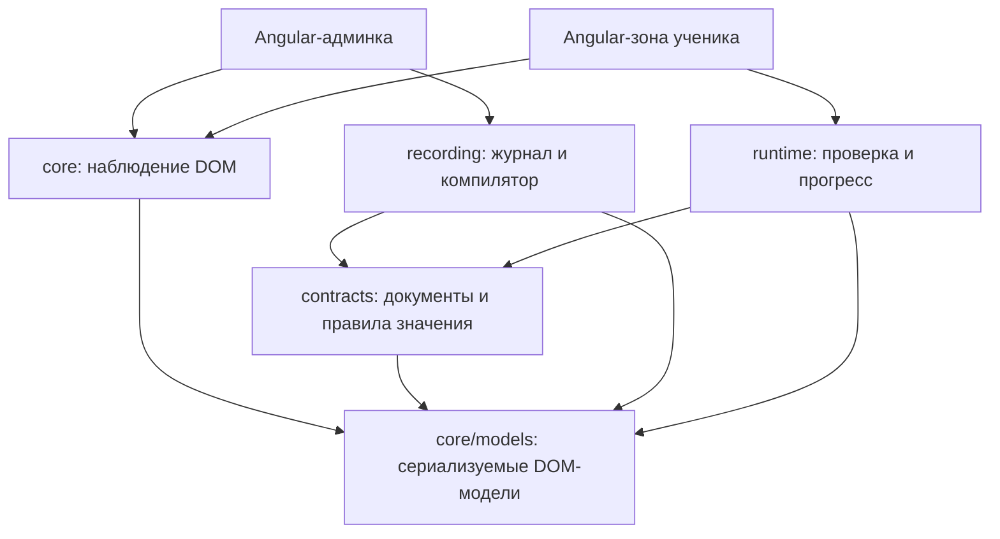
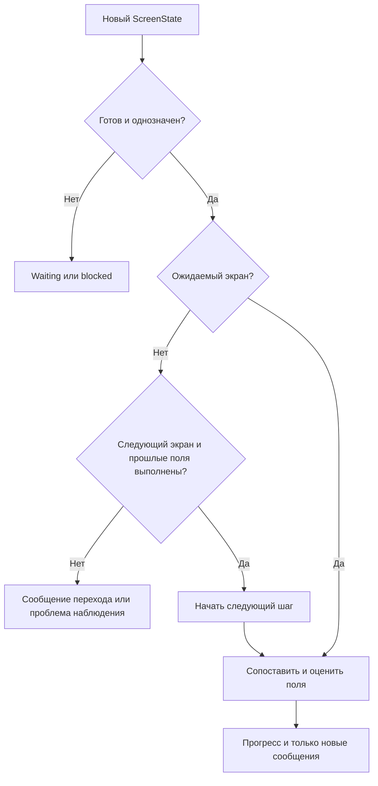

# Архитектура Training Observer

Этот документ описывает текущий код. Незавершённые возможности — в [плане MVP](docs/roadmap.md), прежние решения — в
[архиве](docs/archive/). Алгоритмы не знают названий demo-процедур, их backend или Taiga-форм.

## 1. Границы ответственности

Core — средство наблюдения существующей страницы. Оно сообщает, что видно в DOM, а не правильно ли действует ученик.
Администратор и ученик используют его независимо, в разных сеансах и на разных маршрутах.

Стрелка означает **зависимость кода**. В core нет обратной стрелки на contracts, recording или runtime. `npm run lint`
запускает штатное правило Nx `@nx/enforce-module-boundaries`: разрешённые направления задаются layer-тегами проектов в
`eslint.config.ts`. Отдельного скрипта проверки границ нет. Обычное правило ESLint `no-restricted-imports` уточняет
допустимую точку входа `core/models`, поскольку основной core и его модели принадлежат одному Nx-проекту.
[Документация правила Nx](https://nx.dev/docs/kb/enforce-module-boundaries).

`core/models` — отдельная entry point того же npm-пакета: её можно импортировать без загрузки Angular-фасада. Recording,
contracts и runtime не импортируют Angular, Taiga, DOM-сервисы или приложение. Общие contracts содержат правила чтения
учебного значения; core читает наблюдаемое состояние и не применяет эти правила.

## 2. Как читать исходники

| Вопрос                                        | Начать с                                                                   |
| --------------------------------------------- | -------------------------------------------------------------------------- |
| Что умеет наблюдатель?                        | `libs/training-observer/src/index.ts`, затем `lib/training-observer.ts`    |
| Какие данные он возвращает?                   | `libs/training-observer/models/src/`                                       |
| Как обходится DOM?                            | `lib/capture/dom-snapshot-builder.ts` → `dom-capture.ts`                   |
| Как много DOM-узлов превращаются в одно поле? | `lib/controls/control-adapters.ts` → `control-projection.ts`               |
| Когда создаётся новый снимок?                 | `lib/observation/dom-observation-session.ts`                               |
| Как работает blur?                            | `lib/observation/blur-confirmation.ts`                                     |
| Как определяется экран?                       | `lib/screen/screen-state-reader.ts`                                        |
| Как записывается пример?                      | `libs/training-recording/src/lib/state-recorder.ts`                        |
| Как журнал превращается в ожидания?           | `libs/training-recording/src/lib/scenario-compiler.ts`                     |
| Как проверяются ответы?                       | `libs/training-runtime/src/lib/scenario-runtime.ts` → `field-evaluator.ts` |
| Почему уведомление не повторяется?            | `libs/training-runtime/src/lib/feedback-tracker.ts`                        |
| Что разрешено сохранять?                      | `libs/training-contracts/src/lib/*.models.ts`, `*-codec.ts`                |

В начале модулей описаны назначение и алгоритм. Публичный API каждой библиотеки расположен в её `src/index.ts`.
Внутренние классы не нужно регистрировать в Angular DI или импортировать в приложение.

## 3. Наблюдение: DOM → ControlSnapshot

`TrainingObserver` — Angular Facade одного сеанса. `start(root, overrides)` сначала проверяет настройки и строит
исходный снимок, затем заменяет старый сеанс. Ошибочные настройки не останавливают рабочее наблюдение.

1. `DomSnapshotBuilder` запускает `DomCapture`. Обход учитывает лимиты глубины/узлов, исключённые области, видимость,
   текст, native/ARIA свойства и связанные popup.
2. `DomElementAnalyzer` читает значения **свойств**, а не только атрибуты. Поэтому изменение `input.value` или `checked`
   может быть замечено даже без изменения HTML-атрибута.
3. `ControlSnapshotBuilder` строит логические контролы из графа. `control-adapters` распознаёт native/ARIA и
   поддержанные Taiga-обёртки. `control-projection` собирает target, host, members и locator hints.
4. `snapshotFingerprint` исключает служебное время/стоимость capture из проверки одинаковости публикаций.
5. Фасад публикует readonly signals. Сырые DOM-снимки остаются актуальными во время ввода.

DOM ID вроде `n17` и control ID сессионные. Они предназначены для связи снимка с живым экземпляром, не сохраняются как
единственный устойчивый локатор. Реальные `Element` хранятся вне JSON.

### Когда запускается capture

`DomObservationSession` объединяет MutationObserver, browser events и проверку native properties. Окно batching по
умолчанию 50 мс, проверка свойств — 500 мс. Это фиксированное окно, не бесконечно откладываемый debounce. Events служат
поводом снять состояние, а не журналом кликов.

Служебный UI наблюдателя и декорация прокрутки исключаются, чтобы собственный вывод JSON/подсветка не запускал цикл
наблюдения. Сам scroll не считается учебным действием. Виртуализация обнаруживается по результирующим DOM-изменениям;
ручной capture позволяет обновить геометрию.

`stop()` освобождает listeners, таймеры, MutationObserver и pending work, оставляя последний результат. `clear()`
дополнительно очищает снимок и подтверждения. `DestroyRef` вызывает освобождение автоматически. `flush()` завершает
запланированный capture с сохранением текущих root/options.

## 4. Подтверждение значений после blur

`BlurConfirmation` принадлежит core и отвечает только за наблюдаемую границу редактирования. Он не знает, кто работает —
администратор или ученик.

- Выход из input в декорацию host или явно связанный popup не завершает редактирование.
- При настоящем focusout снимается уходящее поле: обработчик навигации может вскоре удалить его DOM.
- Microtask проверяет, не вернул ли контрол фокус себе, и относится ли работа к текущему сеансу.
- Следующий settled capture выбирает актуальное поле или сохранённое уходящее состояние.
- Только затем обновляется `confirmedControls`. Усечение и скрытые значения не создают подтверждение.

`SelectionEvidence` отдельно запоминает выбранную опцию, реально наблюдавшуюся в popup. Это диагностическое
доказательство, оно не выводится из совпадения текста. Новое редактирование, замена host/связи, неизвестная связь,
loading и усечённый снимок сбрасывают его. Учебное правило ComboBox этому доказательству не равно: contracts сравнивает
видимый текст после blur.

## 5. Экран и области

`readScreenState(snapshot, controls, options)` находит единственный видимый корень по конфигурации, читает существующий
ID из атрибута или прямого текста корня либо его видимого потомка (`identity.element`) и оставляет контролы поддерева.
Положительное условие `ready` блокирует чтение ещё не готовой области; прежний `loading` также поддерживается. Он
возвращает `ready`, `loading`, `unavailable` или `ambiguous` с отдельной причиной. Прямой текст намеренно не включает
значения вложенных input: заполнение не должно менять ключ экрана.

`ScreenVisitTracker` считает A → B → A как три посещения. Замена DOM того же A не создаёт новый логический экран. Сейчас
reader не читает ID из URL; это остаётся задачей MVP.

`TrainingObserver.start(document.body)` — текущий основной путь demo. Можно передать меньший корень.
`MicrofrontendObserver` — дополнительный API отдельных областей с общими browser sources. Его discovery по умолчанию
использует `[data-mf]`, но `observe(selectors)` обнаруживает области по произвольным существующим селекторам, включая
поздний монтаж. Для целевого приложения не требуется добавлять этот атрибут: можно наблюдать готовый корень обычным
`TrainingObserver`. MicrofrontendObserver публикует снимки областей; учебная интеграция demo использует
TrainingObserver.

## 6. Контракты и enum

`ControlType`, `ScreenStatus`, `ScreenIdentityKind` принадлежат core/models. `RecordingEventKind`, `TrainingStatus`,
`MatchStatus` принадлежат contracts. Enum строковые: значение `checkbox` или `ready` остаётся частью стабильного JSON.
Типы на границе принимают также строковые литералы (`type ControlKind = \`${ControlType}\``), поэтому существующие
типизированные конфигурации не требуют замены всех строк на enum. В алгоритмах предпочтительны enum members.

`readControlValue` — единая функция для записи и runtime:

| Контрол                                       | Значение учебной модели                      | Граница последующего изменения |
| --------------------------------------------- | -------------------------------------------- | ------------------------------ |
| Input                                         | точная строка                                | blur                           |
| Number                                        | точная DOM-строка, включая форматирование    | blur                           |
| Select                                        | массив выбранных подписей                    | blur                           |
| ComboBox                                      | массив с видимым текстом; пустое поле — `[]` | blur                           |
| Checkbox / radio / switch                     | boolean                                      | наблюдаемое изменение          |
| Redacted / indeterminate / неизвестный Select | undefined, а не false или пустая строка      | оценка недоступна              |

`false`, `''` и `[]` — полноценные значения. Сравнение точное, с сохранением порядка массива и форматирования числа.
Суммы `1 500` и `1500` пока не нормализуются в одно число. Совпадение текста ComboBox не доказывает backend ID или выбор
из списка. Если Taiga очистила недопустимый текст на blur, записывается оставшееся пустое значение.

Parsers принимают `unknown`, проверяют ключи, типы, версии, лимиты, descriptors и expected values. `scenario-codec` не
создаёт фиктивную запись: общие guards выделены в `validation.ts`. Проверка формы JSON отделена от семантики журнала,
которую проверяет компилятор.

## 7. Запись и итоговая модель

`StateRecorder` создаётся админкой. Он принимает только ScreenState и confirmedControls, без DOM/DI. Алгоритм `observe`:

1. Принять новые подтверждения известных полей уходящего экрана.
2. При loading ждать; при недоступности добавить явный пропуск, не придуманный переход.
3. При новом готовом ключе создать посещение и сбросить память немедленных значений.
4. Привязать текущие поля к посещению, принять их первые подтверждения.
5. Для checkbox/radio сохранить исходное состояние и последующие изменения; для прочих немедленных контролов —
   изменения. Input/Number/Select/ComboBox без blur в журнал не попадают.

Одинаковый снимок не добавляет строк. Журнал содержит историю, `snapshot()`/`stop()` возвращают копию. `compileScenario`
группирует строки по посещению и оставляет последнее значение каждого descriptor. Все поля по умолчанию обязательны.
Radio пока представлен отдельными boolean-ожиданиями на варианты; визуальный редактор групп — будущая работа.

`removeRecordedEvent` — чистое преобразование, не изменяющее оригинал. Сохраняет visit, перенумеровывает sequence, не
позволяет скрыть общий пропуск наблюдения. Удаление границы с оставшимися полями делает запись неполной. Undo реализован
в админке снимками документов (Memento); история живёт до reload/новой записи.

## 8. Прохождение

`ScenarioRuntime` координирует шаги, `FieldEvaluator` оценивает поля, `FeedbackTracker` подавляет повторы. Ни один из
них не вызывает Taiga Alert и не читает localStorage.

При входе исходные значения каждого распознанного экземпляра поля оцениваются сразу. Правильная предзаполненная сумма
засчитывается без фокуса. Неверное исходное значение не засчитывается, но не вызывает уведомление. Поздно появившееся
поле и remount получают своё исходное состояние. Последующие текстовые изменения заменяют его после blur. Возврат с
неправильного экрана принимает восстановленные ответы.

Поля внутри шага независимы по порядку. Перед переходом runtime проверяет последнее состояние прошлого экрана, включая
позднее подтверждение уходящего поля. Пропущенные обязательные ответы не обходятся переходом. Смена правильного ответа
на неправильный снимает выполненность; ожидаемый false проверяется так же, как true.

Matcher использует тип, стабильный ID, label, name, placeholder и контекст. Веса соответственно 100/80/40/30/20,
минимальная оценка 80, минимальный отрыв 30. Сгенерированные ID исключаются из сильного признака. Один текущий контрол
не может удовлетворять двум обязательным ожиданиям. Missing/ambiguous блокируют оценку. Значения и координаты не влияют
на выбор кандидата.

`feedback` содержит новые объекты `{kind: FeedbackKind, message: string}` одного обновления. Ошибка берётся из `message`
ожидания, успех — из необязательного `successMessage`; пустой текст не отображается. Полная история уведомлений не
хранится в runtime. Повторные сканы не дублируют одну ошибку; исправление позволяет сообщить о новом ошибочном
изменении. `complete` не останавливает наблюдение автоматически: изменение ответа ещё может снять выполненность.

## 9. Angular-интеграция и demo

`pages/record` содержит страницу записи, редактор и RecordingStore. `pages/learn` содержит зону ученика.
`shared/demo-form` — независимое тестовое приложение с HTTP-схемой, а `shared/scenarios` — хранение опубликованного
документа, используемое обоими маршрутами. Форма не импортирует библиотеку обучения.

Компоненты standalone, с OnPush; шаблоны и стили вынесены из TypeScript. DI через inject, наблюдатель предоставлен на
уровне страницы, запуск DOM-работы — afterNextRender. Readonly signals наружу, запись состояния через методы сервисов.
Effects используют наблюдение как внешний источник, подписки Taiga закрываются через DestroyRef.

Админка явно компилирует и публикует сценарий. Изменение журнала не изменяет публикацию ученика. Метаинформация
связывает точный JSON записи с опубликованным сценарием. После reload несовпадение/отсутствие связи блокирует повторную
публикацию без пересборки. Ошибка storage показывается отдельно.

Taiga UI 4 `TuiAlertService` принадлежит только интеграции ученика. Он отображает сообщения runtime. Тестовый backend,
названия процедур и кнопки «Далее»/«Неправильный переход» относятся только к demo.

## 10. Паттерны и ограничения

| Приём      | Где применяется                         | Зачем                                                   |
| ---------- | --------------------------------------- | ------------------------------------------------------- |
| Facade     | TrainingObserver, MicrofrontendObserver | компактный Angular API над browser-механизмами          |
| Adapter    | control-adapters                        | разные DOM-структуры → одна модель контрола             |
| Observer   | signals и browser sources               | доставка новых состояний без связи с учебным алгоритмом |
| Memento    | undo в админке                          | восстановление документа без обратных DOM-действий      |
| Композиция | runtime + evaluator + feedback tracker  | небольшие ответственности без иерархии состояний        |

Не введены абстрактные фабрики на каждый input, глобальный event bus или отдельные классы на каждый статус. Чистая
функция используется там, где объект не владеет состоянием. Enum не превращаются в классы ради паттерна State.

Границы подхода: снимки не доказывают конкретный клик, просмотр справки без видимого результата, источник изменения
значения, состояние между capture и тождество неразличимых полей. Закрытые Shadow DOM/iframe, виртуальные невидимые
варианты, неоднозначные popup и лимиты обхода требуют явного отказа или отдельной интеграции. Готовность асинхронных
предзаполнений должна задаваться контрактом экрана: появление input до ответа backend ещё не гарантирует, что его первое
значение окончательное. Этот рефакторинг не решает новые задачи MVP.

Рекомендации оформления основаны на [Angular style guide для v19](https://v19.angular.dev/style-guide),
[readonly signals](https://angular.dev/guide/signals) и
[строковых enum TypeScript](https://www.typescriptlang.org/docs/handbook/enums).
