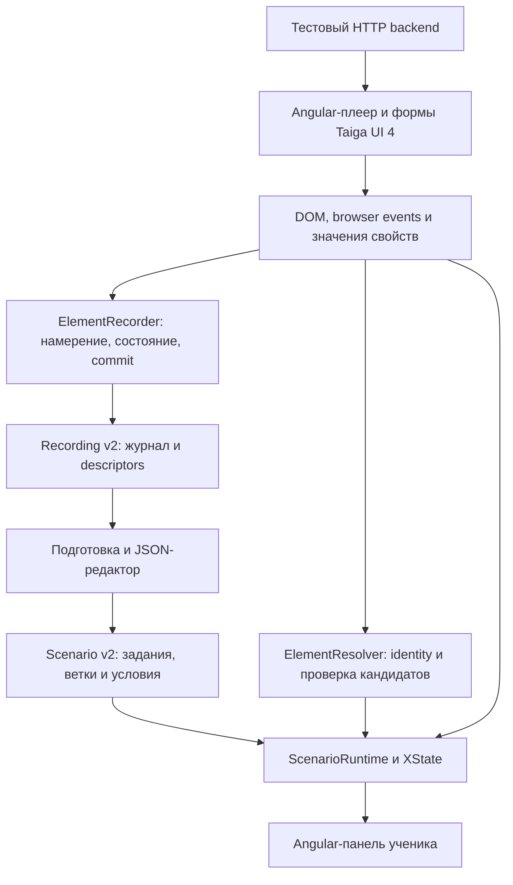
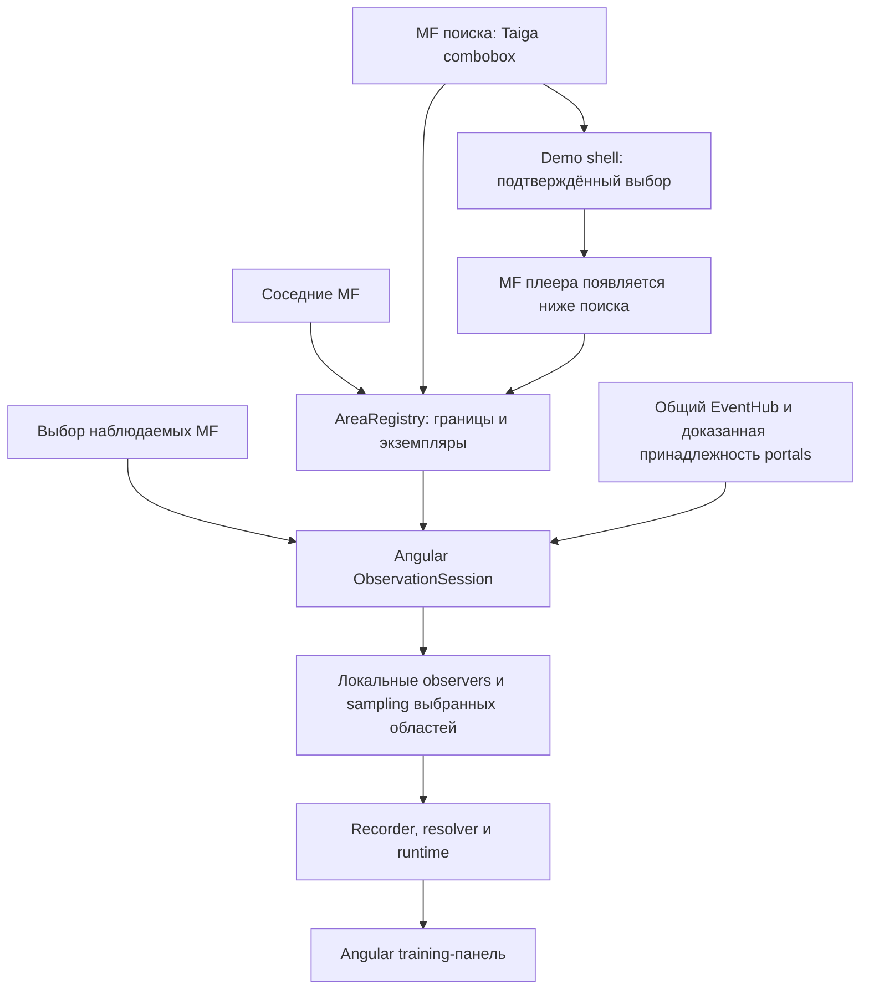

# Training Observer: устройство проекта

Библиотека наблюдает действия пользователя в существующем интерфейсе и проверяет прохождение учебного сценария. Она
связывает действия с DOM-целями по наблюдаемым признакам, ожидает появление динамических полей и показывает заранее
заданные подсказки. При неоднозначности поиск должен отказать, а не выбирать элемент по позиции.

Demo — обычное Angular-приложение для проверки библиотеки. Его формы и HTTP backend моделируют поведение плеера; они не
передают библиотеке свою внутреннюю модель. LLM, Driver.js и специальные tracking-hooks не используются в рабочем пути.
Старые неподключённые черновики сохранены отдельно и не являются образцом новой реализации.

## Что работает сейчас

Завершён технический spike на Angular 19 и Taiga UI 4. Администратор записывает процедуру на `/spike/record`, выбирает
признак успешного результата и редактирует JSON сценария. Ученик проходит его на `/spike/learn`. Сейчас каждая страница
монтирует один плеер рядом с training-панелью; реальная отдельная сборка MFE не реализована.

Стрелки обозначают потоки данных. Библиотека получает DOM, но не подписывается на HTTP payload или FormRecord плеера.
Runtime использует recorder для подтверждения действий, resolver для поиска и отдельные predicates для completion. Клик
не равен выполнению операции, а конец списка шагов не равен успешному завершению процедуры.

## Куда смотреть в коде

| Часть        | Ответственность                                                          | Расположение                                                                                            |
| ------------ | ------------------------------------------------------------------------ | ------------------------------------------------------------------------------------------------------- |
| Contracts    | Строгие JSON-типы и validation                                           | [contracts](libs/element-spike/src/contracts/)                                                          |
| DOM identity | Общие признаки цели и контекста                                          | [identity.ts](libs/element-spike/src/dom/identity.ts)                                                   |
| Recording    | Capture, properties, мутации, подтверждение input/select                 | [recording](libs/element-spike/src/recording/)                                                          |
| Resolution   | Semantic locators, CSS fallback с проверкой identity, similarity и отказ | [resolution](libs/element-spike/src/resolution/)                                                        |
| Runtime      | Шаги, условия, branching, поколения ожиданий и cleanup                   | [runtime](libs/element-spike/src/runtime/)                                                              |
| Training UI  | Запись/подготовка и прохождение                                          | [record](projects/demo/src/pages/record/), [learn](projects/demo/src/pages/learn/)                      |
| Demo-плеер   | Серверная схема → Angular controls → отправка значений                   | [procedure](projects/demo/src/pages/procedure/)                                                         |
| Test backend | Динамические поля, 422, задержки, retry                                  | [procedure-server](scripts/procedure-server/)                                                           |
| Проверки     | Чистые unit tests, browser workflows, benchmark                          | [unit tests](libs/element-spike/tests/), [browser tests](tests/), [benchmark](scripts/spike-benchmark/) |

Принятые модули v2 находятся в перечисленных подпапках библиотеки. Файлы старой реализации непосредственно в
`libs/element-spike/src` и компоненты `projects/demo/src/pages/spike` — черновики. Страница `/spike/research` содержит
исследовательские инструменты и исторический отчёт; `/spike/benchmark` показывает зафиксированные измерения.

## Следующая реализация: несколько микрофронтов

**Запланировано, ещё не реализовано.** Пользователь обновляет проект до Angular 21; новая библиотечная обвязка строится
через Angular DI, signals, lifecycle и тестируемые services. Demo специально не оптимизируется и не переводится
принудительно на zoneless. Подробный порядок работ: [план multi-MF](docs/spike/microfrontend-plan.md).

Внутренняя связь «выбрана процедура → открыть плеер» принадлежит demo shell. Библиотека узнаёт о выборе и появлении
нового MF через наблюдаемый DOM, а не через специальное событие для обучения. Соседние области могут продолжать работать
без записи их значений. Отдельно планируется необязательная политика блокировки взаимодействий; отключение наблюдения не
означает блокировку кликов.

## Правила разработки

- Один понятный источник состояния, явные входы и команды, предметные имена и небольшие функции.
- Компоненты описывают UI; services управляют сеансами и зависимостями; чистые функции выполняют matching/validation.
- Над каждым `@Component` — описание назначения и алгоритма на русском. В сложных компонентах указаны входы,
  последовательность обработки и освобождение ресурсов. Описание обновляется вместе с изменением алгоритма.
- Native observers изолированы в browser-адаптере и привязаны к lifecycle; Angular render hooks одного MF не заменяют
  наблюдение чужого DOM. Training UI не добавляет hooks в поля плеера.
- Оптимизация касается работы библиотеки и подтверждается измерениями на обычном demo, а не облегчением target-форм.

## Что доказано и где граница

[Benchmark](docs/spike/benchmark.md): 368/369 доступных различимых целей восстановлены; одна неразличимая подмена
бизнес-сущности дала false accept. На живой процедуре — 29 точных совпадений и 12 корректных отказов для отсутствующих
полей. Эти числа относятся к тестовому набору и не гарантируют результат на произвольном приложении.

Итог spike — условный go для ограниченного пилота. Одинаковые сущности и скрытый серверный результат могут потребовать
интеграции или отказа от автоматического зачёта. [Архитектурные решения](docs/spike/architecture.md),
[ограничения](docs/spike/limitations.md), [запуск demo и команды](README.md).
