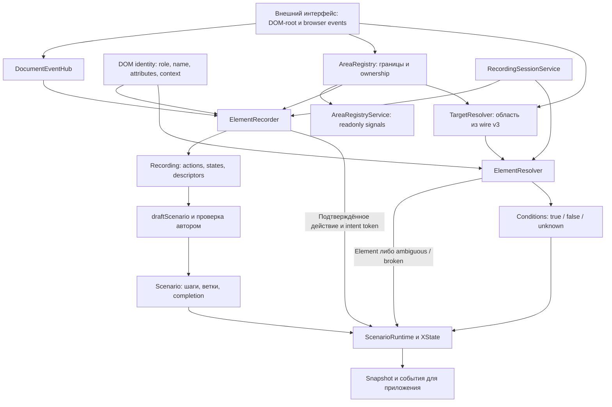

# Библиотека Training Observer

Библиотека записывает действия пользователя в существующем интерфейсе, сохраняет описание DOM-целей и проверяет
прохождение учебного сценария. Она наблюдает DOM/browser events и свойства controls, не получая внутреннюю модель
целевого Angular-приложения. При недостаточных признаках поиск возвращает отказ, а не выбирает цель по позиции.

Документ описывает **библиотеку**. Demo — внешнее тестовое приложение; его устройство и запуск описаны в
[README](README.md). Формы demo не являются частью архитектуры наблюдателя.

## Библиотека и приложения

Библиотека работает **без UI**: наблюдает DOM, описывает и находит цели, проверяет действия и условия, отдаёт состояние
и события через программный API. Angular-интеграция отвечает за DI и lifecycle, без визуальных компонентов.

**Админка** — отдельное приложение для записи и редактирования заданий, подсказок, значений, веток и completion. **Режим
ученика** — существующий рабочий интерфейс с автоматической проверкой. При входе в тренировку интеграция загружает
сценарий и запускает наблюдение без кнопки «Начать обучение» и отдельной панели. Подсказки отображает приложение по
событиям/состоянию библиотеки; renderer подсказок не входит в ядро.

Наблюдение ученика не создаёт новый авторский сценарий. Постоянное сохранение журнала прохождения — отдельная политика
приложения. При выходе интеграция останавливает сеанс и освобождает ресурсы. Повторный вход не дублирует listeners. До
загрузки сценария проверка не готова; прошлые действия не засчитываются задним числом. После загрузки запуск
автоматический. Отсутствующий MF ожидается, ошибка загрузки сообщается приложению.

Это целевая архитектура: текущие ручные кнопки запуска и JSON-панель ученика — диагностика spike. Автоматическое
подключение при входе ещё предстоит реализовать.

## Порядок действий: свободное заполнение

Порядок действий администратора при записи **не задаёт обязательную последовательность** для ученика. Администратор и
ученик могут заполнять доступные поля в любом порядке, в том числе в разных наблюдаемых MF. Timestamp и порядок событий
сохраняются для диагностики и корректного intent/commit, но не превращаются в зависимости сценария.

Целевая модель — набор ожидаемых действий и условий. Каждое подтверждённое действие ученика сопоставляется со всеми
доступными невыполненными ожиданиями по области, элементу, типу действия и значению. Единственное надёжное соответствие
отмечает ожидание выполненным; несколько равноправных соответствий дают ambiguity, без выбора первого. Чужое действие не
продвигает сценарий. Завершение требует выполнения обязательных ожиданий и итоговых условий.

Для ввода сохраняется ожидаемое итоговое значение, а не обязательное воспроизведение каждого исправления администратора.
При последующей смене правильного значения на неправильное условие поля снова становится невыполненным: факт прошлого
совпадения не доказывает правильность формы при завершении. Одно событие не закрывает несколько неоднозначных ожиданий.

Динамические поля становятся доступными после появления; отсутствие будущего поля не является ошибкой ученика.
Зависимости отражают доступность интерфейса и явно заданные условия/ветки, а не хронологию записи. Например, новую форму
нельзя заполнить до её появления, но её доступные поля заполняются в любом порядке. Требование строгого порядка сейчас
не вводится.

Это новая целевая модель. Текущий runtime spike использует один активный шаг и линейный черновик: он ещё не реализует
свободный порядок. Нужны изменения authoring, контракта сценария и runtime, а не только перестановка шагов в UI.

## Подтверждение текстового ввода

Для администратора и ученика действует одно правило: события input обновляют внутренний черновик, а сравнение текстового
значения с ожиданием выполняется при blur — выходе из поля. Пауза при наборе не подтверждает ввод. Одно редактирование
до выхода даёт не более одного semantic input с итоговым значением; повторный выход без изменений не создаёт ещё одно
действие. Нативный change не должен дублировать blur или преждевременно засчитывать текст.

После начала нового редактирования ранее подтверждённое поле считается изменяемым: старое совпадение не позволяет
завершить тренировку. При этом каждый символ не порождает действие/подсказку об ошибке. На blur подтверждается
актуальное значение с учётом синхронной нормализации контрола; последующие программные изменения остаются отдельными
state updates, а не действиями ученика. Незавершённый IME-ввод не подтверждается.

Checkbox/radio/select подтверждаются отдельным событием изменения/выбора. Для combobox различаются текст поиска и
выбранная option: blur внутреннего input при переходе в popup сам по себе не доказывает выбор.

Submit по Enter без blur, удаление поля и выход из тренировки не должны молча подтверждать черновик. На первом этапе нет
автоматического зачёта в этих случаях: runtime сообщает о неподтверждённом вводе. Если понадобится подтверждение через
submit, оно вводится отдельной явной политикой и проверяется до обработки completion, без зачёта каждого Enter.

Сейчас прототип отличается: recorder подтверждает текст также после idle (по умолчанию 400 мс), change и некоторых
flush-переходов. Правило blur-only ещё не реализовано. В этапе 4 заменить эти пути единой политикой и проверить:
медленный набор с паузами; input → change → blur без дублей; Tab; повторный фокус без изменения; исправление значения;
IME; синхронную маску; combobox popup; submit без blur; unmount и поздние state updates.

## Потоки данных

Registry подключён к recorder и поиску целей текущего сеанса через RecordingSessionService. Привязки target → area
сериализуются в Recording/Scenario v3; learner подключает registry и TargetResolver.

Contracts/validation ограничивают данные на границах импорта, authoring и runtime. Стрелки описывают передачу данных, а
не наследование классов. Во время прохождения runtime владеет экземпляром recorder. Панель вызывает команды и показывает
snapshot; она не должна дублировать алгоритм выбора цели и прохождения.

## Модули и ответственность

Все указанные пути находятся внутри `libs/training-observer/src`.

| Модуль                                                                      | Назначение и основные точки входа                                                                    |
| --------------------------------------------------------------------------- | ---------------------------------------------------------------------------------------------------- |
| [areas](libs/training-observer/src/areas/)                                  | AreaRegistry: discovery, конфликты, поколения и ownership; AreaRegistryService: DI/lifecycle/signals |
| [contracts](libs/training-observer/src/contracts/)                          | Recording/Scenario v2/v3, Resolution v2, parse/read/serialize и строгая validation                   |
| [dom/identity.ts](libs/training-observer/src/dom/identity.ts)               | Общие признаки цели, контекст, доступность; используется записью и поиском                           |
| [recording/dom.ts](libs/training-observer/src/recording/dom.ts)             | `describe` создаёт descriptor, `readValue` читает значение по политике                               |
| [recording/recorder.ts](libs/training-observer/src/recording/recorder.ts)   | `ElementRecorder`: start/stop, capture, inventory, intent/commit, snapshots и экспорт                |
| [resolution/resolver.ts](libs/training-observer/src/resolution/resolver.ts) | `ElementResolver.resolve`: проверка цели в текущем root, evidence и отказ                            |
| [runtime/authoring.ts](libs/training-observer/src/runtime/authoring.ts)     | `draftScenario`: линейный черновик из записи и выбранного признака результата                        |
| [runtime/conditions.ts](libs/training-observer/src/runtime/conditions.ts)   | Проверка условий по текущему DOM и committed value текущего шага                                     |
| [runtime/runtime.ts](libs/training-observer/src/runtime/runtime.ts)         | `ScenarioRuntime`: start/stop/retry/skip, поколения шага и snapshots                                 |

Это единственные рабочие модули библиотеки; прежние дублирующие реализации удалены. Пакет собирается ng-packagr в
dist/training-observer. Публичный API — @training-observer/core; Angular facade экспортируется отдельно из
@training-observer/core/angular. Demo не импортирует внутренние файлы. Сервис находится в src/angular и зависит от
основного entry point; ядро не зависит от Angular. Исследовательские отчёты сохранены как исторические данные.

## Алгоритм текущего runtime

1. Recorder строит inventory выбранного root и описания целей. Capture events дают намерение пользователя;
   MutationObserver и sampling properties дают наблюдаемые состояния. State update сам по себе не является действием.
2. Input/select подтверждаются по значению и принадлежности контролу. Portal option учитывается только при доказанном
   owner. Recording сохраняет actions и states раздельно, без живых Event/Element-ссылок.
3. Authoring преобразует запись в черновик. Автор проверяет задания, expected values, branches и completion. Видимость
   следующей цели не всегда доказывает успешный клик — автоматический черновик требует проверки.
4. Runtime заново разрешает цель шага. Resolver проверяет semantic context, совместимость identity, locators, score и
   разрыв между кандидатами. Даже единственный CSS-результат не принимается без identity proof.
5. Подходящее действие активирует проверку completion. Неизвестное состояние не превращается в false ради перехода;
   несколько подходящих веток означают ambiguity. Конец графа требует отдельного глобального completion.
6. Token поколения связывает intent и отложенный commit. При смене шага/повторе старые tokens инвалидируются; stop
   освобождает listeners, observers и timers. Runtime не отменяет запросы чужого приложения.

## Правила кода библиотеки

- Предметные имена, явный поток данных и небольшие функции; services отвечают за ресурсы и сеанс, чистые функции — за
  matching/validation. Обобщения вводятся по реальной потребности.
- В начале модуля/над классом — описание назначения и алгоритма на русском. Указывать входы, важный порядок действий,
  побочные эффекты и cleanup, когда они есть.
- Комментарии обновляются в том же изменении, что и алгоритм. Не пересказывать очевидные строки и не выдумывать
  сложность для простого модуля. Эти требования относятся к библиотеке, не к формам demo.
- Angular DI/signals/lifecycle управляют библиотечной обвязкой. Browser APIs изолированы в адаптере: render hooks одного
  Angular MF не сообщают обо всех изменениях соседнего приложения.
- Оптимизация библиотеки проверяется на реалистичном target DOM; нельзя улучшать метрики искусственным упрощением demo.

## Следующий цикл и границы

[План multi-MF](docs/implementation-plan.md): AreaRegistry и Angular facade реализованы, EventHub и выбор областей
записи подключены через RecordingSessionService. Wire v3 переносит привязки областей в learner через TargetResolver.
Свободный порядок, blur-only и автоматический запуск остаются следующими изменениями. Обновление Angular отложено:
начинаем на текущей 19.2.25; новая библиотечная обвязка должна следовать указанным в плане Angular-практикам. Саму
demo-форму специально оптимизировать или переводить на zoneless не требуется. Driver.js не используется.

[Benchmark](docs/spike/benchmark.md) подтвердил 368/369 восстановлений доступных различимых целей на тестовой матрице.
Подмена бизнес-сущности при одинаковом DOM дала один false accept: DOM-only алгоритм не видит скрытой смены сущности.
[Архитектурные решения MVP](docs/spike/architecture.md), [ограничения](docs/spike/limitations.md),
[проверки ядра](libs/training-observer/tests/) и [browser tests](tests/) уточняют область доказанных возможностей.
